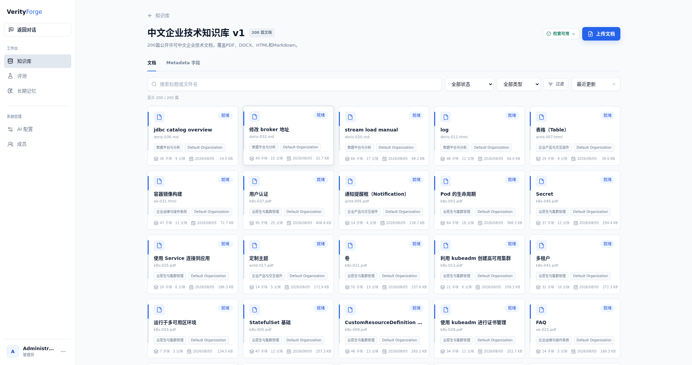
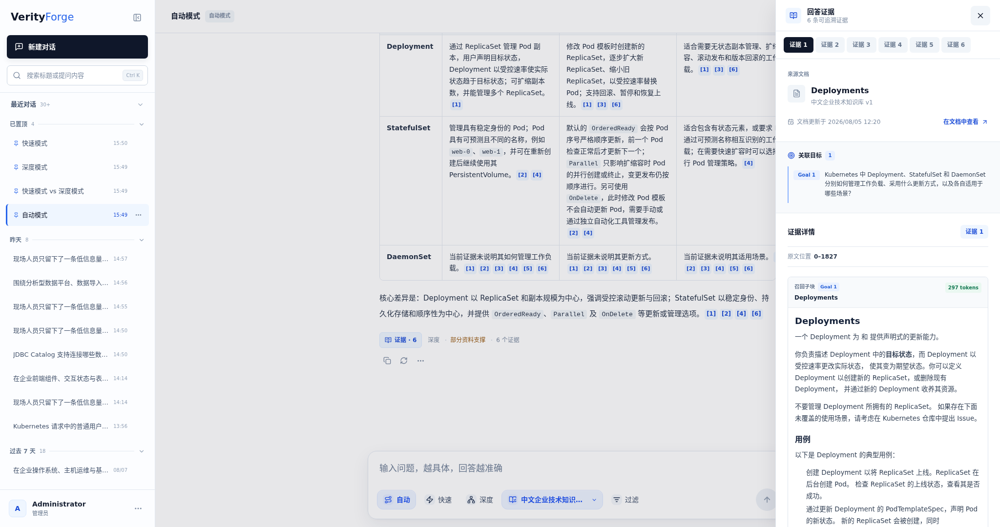
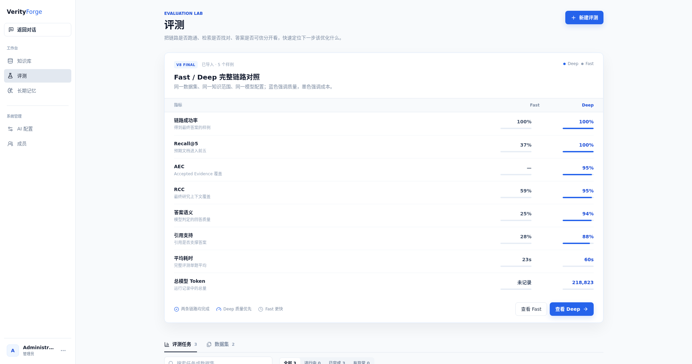
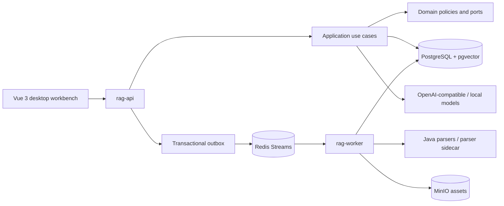

# VerityForge

An evidence-first enterprise knowledge base and question-answering system. VerityForge combines governed multi-format ingestion, Fast RAG, Deep RAG, retrieval-aware routing, evaluation, and source-level citations in one desktop web workspace.

[简体中文](README.md) · [Live demo](http://idcmnt1.truesight.com.cn:18306) · [Design index](docs/README.md) · [200-case report](benchmarks/deep-rag-final-200-case.md) · [Dataset](data/chinese-enterprise-rag-v1/README.md)

> The shared HTTP demo is maintained as a separate deployment. Publishing this repository does not rebuild or restart it. Do not upload private documents, enter production credentials, or load-test the service.

> The demo is a shared HTTP preview and may be updated or temporarily unavailable. Do not upload private documents, enter production credentials, or run load tests. The repository screenshots are the stable portfolio reference.


## Release Snapshot

| Area | Public release |
| --- | --- |
| Product | Desktop web only |
| Knowledge base | Chinese Enterprise Technical Knowledge Base v1 |
| Corpus | 200 public-license Chinese documents: 50 PDF, 50 DOCX, 50 HTML, 50 Markdown |
| Hard benchmark | 200 multi-intent, decomposition, paraphrase, and sparse-keyword questions |
| Evaluation model | `gpt-5.6-luna`, `reasoning_effort=low` |
| Deep retrieval | Recall@5 `0.9758`, AEC `0.9191`, RCC `0.9373` |
| Deep latency | P50 `38.6s`, P95 `60.5s`, retrieval/evidence scope |
| Default Auto profile | Research tokens `-50.16%`, research time `-50.04%`, Recall@5 `0.8667` |
| Project license | Viewing, learning, and private non-commercial evaluation only |

The metrics are tied to fixed datasets and persisted run snapshots. The 200-case report evaluates retrieval and evidence selection, not final natural-language answers. A separate five-case benchmark evaluates the complete answer and citation chain.

## Product Story

### Governed knowledge ingestion

Documents move through parsing, normalization, adaptive parent/child chunking, embedding, version publication, and quality checks. Document metadata records provenance, source project, format, upstream revision, license, business domain, effective dates, and organization. Chunk records retain document version, section path, source blocks, parent relation, offsets, and rendered content.

The final policy targets 1,000-token parent chunks with a 1,200-token ceiling and 250-token child chunks with a 384-token ceiling. Child chunks provide precise retrieval; parent chunks restore enough context for answer generation and source inspection.



See [Knowledge ingestion](docs/knowledge-base.md).

### Fast mode

Fast handles direct facts and routine procedures through contextual query rewriting, concurrent keyword and semantic retrieval, RRF fusion, reranking, parent-context assembly, and one streaming answer call. It keeps the shortest path that still returns inspectable evidence.


See [Fast mode](docs/fast-mode.md).

### Deep mode

Deep is a bounded, persisted research state machine for multi-goal, cross-document, comparative, and staged questions:

```text
request analysis
  -> up to three goals and requirements
  -> keyword + semantic query pairs per goal
  -> concurrent retrieval, RRF, and reranking
  -> child-to-parent expansion
  -> goal-batched parent deep read
  -> evidence sufficiency judgment
  -> at most one gap-retrieval round
  -> unique-parent, coverage-first evidence packing
  -> one final answer call
```

The Evidence Judge marks each requirement covered or missing. Missing goals alone receive a repair search. A parent supporting several goals is serialized once while retaining its goal/evidence associations.


See [Deep mode](docs/deep-mode.md).

### Auto mode

Auto does not pay for a separate routing model. It performs reusable Fast pre-retrieval (`Keyword Top30 + Semantic Top30 -> RRF Top40`) and combines question structure, Top-5 title hits, and fail-Deep safeguards.

The default cost-first profile routes 107 of the 200 replay cases to Fast. Against all-Deep research it saves `50.16%` of tokens and `50.04%` of mean time, while Recall@5 moves from `0.9633` to `0.8667`. These are research-stage values; neither side generated a final answer in this replay. A quality-first profile saves `27.58%` of tokens with Recall@5 `0.9367`.



See [Auto routing](docs/auto-mode.md) and the [cost-quality report](benchmarks/auto-routing-cost-quality.md).

### Evaluation

The hard 200-case suite contains:

| Challenge | Cases |
| --- | ---: |
| Multi-intent | 80 |
| Query decomposition | 60 |
| Semantic paraphrase | 40 |
| Sparse keyword | 20 |

The final `gpt-5.6-luna / low` retrieval-and-evidence run completed 200/200 cases after resumable continuation: Recall@5 `0.9758`, Recall@10 `0.9808`, AEC `0.9191`, RCC `0.9373`, P50 `38.6s`, and P95 `60.5s`. Actual usage was 8,056,623 tokens across 210 physical attempts, including ten failed attempts recovered without rerunning successful cases.

Against the historical GPT-5.5 ReAct baseline on the same suite, Recall@5 increased from `0.8550`, P50 fell from `70.1s`, and actual token use fell `57.7%`. Read the [full report](benchmarks/deep-rag-final-200-case.md).

The separate complete-answer suite reports Deep Recall@5 `1.0000`, semantic correctness `0.9740`, citation support `0.9460`, and mean latency `78.6s`; Fast averages `21.3s` but reaches Recall@5 `0.3667` on these deliberately difficult multi-goal cases. Read the [complete-answer comparison](benchmarks/fast-vs-deep-full-answer.md).



### Citation provenance

An answer citation resolves through the evidence record, goal/requirement association, recalled child chunk, deep-read parent chunk, document version, source block, page or offset, and original asset. Fast usually cites the matched child and exposes its parent context. Deep cites accepted parent evidence and shows which child anchors and goals led to it.

See [Citation provenance](docs/citations.md).

## Architecture



The public source contains one current Fast implementation and one current Deep implementation. Historical pipeline identifiers remain only in evaluation compatibility readers for persisted artifacts; they do not participate in current request orchestration.

| Path | Responsibility |
| --- | --- |
| `apps/rag-api` | REST, SSE, authentication, chat, knowledge, evaluation, and administration |
| `apps/rag-worker` | Parsing, normalization, chunking, embeddings, retries, and recovery |
| `modules/rag-domain` | Chunking, retrieval, Deep state, budgets, and evidence models |
| `modules/rag-application` | Fast, Deep, Auto, and evaluation orchestration |
| `modules/rag-infrastructure` | PostgreSQL, pgvector, Redis, MinIO, model, and parser adapters |
| `modules/rag-contract` | API, SSE, event, and sidecar contracts |
| `web` | Vue 3 and TypeScript desktop workbench |
| `data/chinese-enterprise-rag-v1` | 200 converted documents, 440-case blueprint, manifests, checksums, and licenses |

See [Architecture](docs/architecture.md) for ownership and recovery semantics.

## Dataset and Reproduction

The complete corpus is committed to this repository; it does not depend on another private snapshot.

```bash
python3 scripts/build-chinese-enterprise-dataset.py --verify-only
```

The command verifies all 200 documents, source checksums, and 440 evaluation cases. The 200-case hard subset and 200-case Auto routing suite are under `benchmarks/`. Converted documents retain their upstream licenses, including CC BY-SA 4.0 for openEuler-derived material.

## Local Evaluation

Prerequisites are Docker Compose and Node.js 22+. The repository bootstraps a local JDK 25 and Maven Wrapper.

```bash
cp .env.example .env
./scripts/bootstrap-toolchain.sh
docker compose up -d postgres redis minio minio-init
./mvnw test
```

Build and start the application images:

```bash
./mvnw -DskipTests package
docker compose --profile app up --build
```

Never commit `.env`, API keys, JWT secrets, model checkpoints, database dumps, or real organization documents. See [Development](docs/development.md) and [Deployment](docs/deployment.md).

## License and Boundaries

Original VerityForge source and documentation use the [VerityForge Viewing and Learning License](LICENSE). It permits reading, study, and private non-commercial evaluation; it does not permit redistribution, public hosting, or commercial use without written authorization.

Third-party dependencies and dataset files remain under their own licenses. See [Third-Party Notices](THIRD_PARTY_NOTICES.md) and the [dataset README](data/chinese-enterprise-rag-v1/README.md). This repository is a self-contained portfolio snapshot, not a managed service or a production-readiness guarantee.

Author: [Yanyue](https://github.com/yanyue2024).
