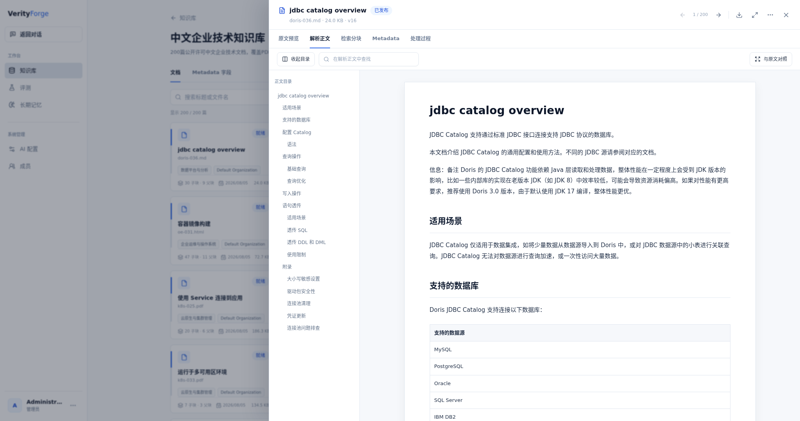
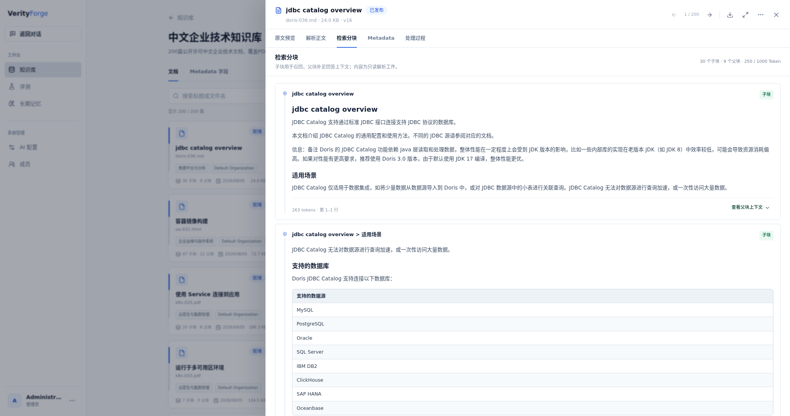
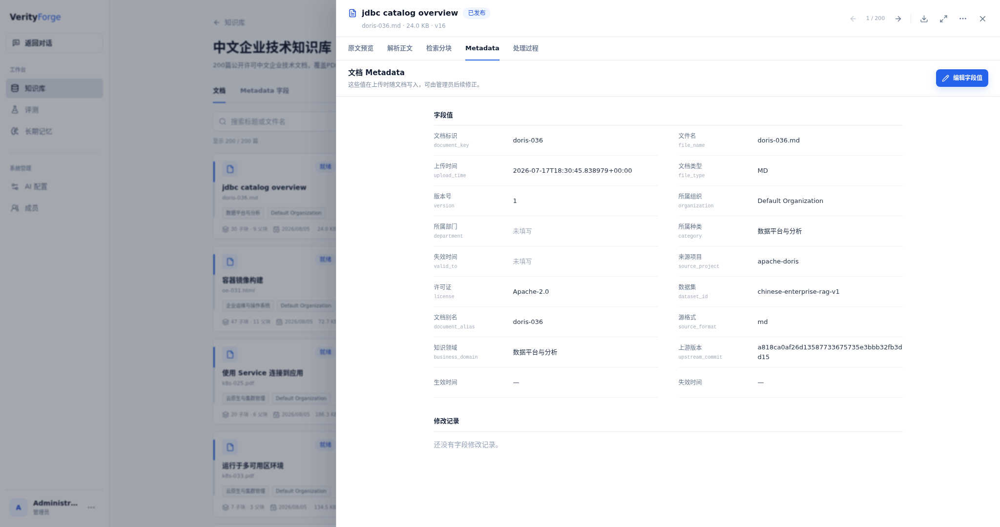
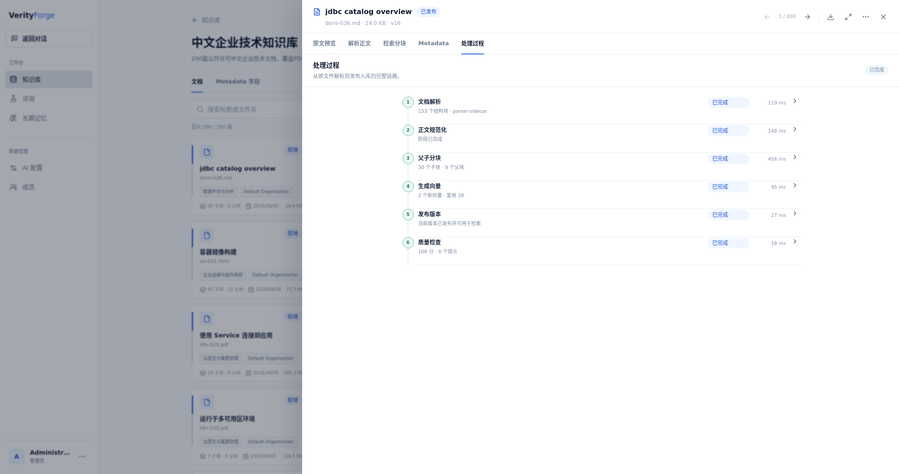
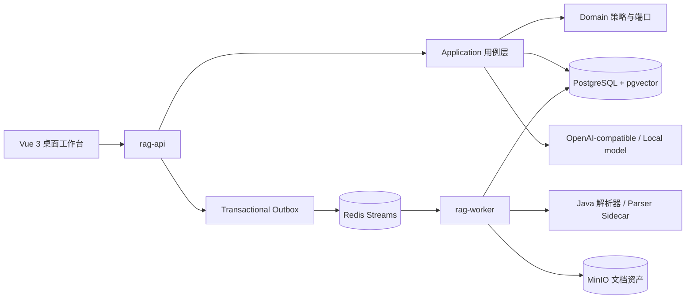

# VerityForge

面向企业文档的证据优先知识库与智能问答系统。它把多格式文档治理、Fast RAG、Deep RAG、自动路由、评测和引用溯源放在同一个桌面 Web 工作台中。

[English](README.en.md) · [在线 Demo](http://idcmnt1.truesight.com.cn:18306) · [系统设计](docs/README.md) · [200 题评测报告](benchmarks/deep-rag-final-200-case.md) · [数据集说明](data/chinese-enterprise-rag-v1/README.md)

> Demo 是独立维护的共享 HTTP 展示环境，本仓库发布不会更新或重启它。请勿上传私密文档、输入生产凭据或进行压力测试。仓库内截图是稳定的作品展示入口。


## 项目快照

| 项目 | 当前公开版本 |
| --- | --- |
| 产品形态 | 仅展示桌面 Web，不包含移动端 |
| 知识库 | 中文企业技术知识库 v1，200 篇公开许可中文技术文档 |
| 文档格式 | PDF、DOCX、HTML、Markdown 各 50 篇 |
| 困难评测集 | 200 题：多意图、Query 拆解、语义改写、低关键词表达 |
| 评测模型 | `gpt-5.6-luna`，`reasoning_effort=low` |
| Deep 结果 | Recall@5 `0.9758`，AEC `0.9191`，RCC `0.9373` |
| Deep 延迟 | P50 `38.6s`，P95 `60.5s`，口径为检索与证据阶段 |
| Auto 默认档 | 研究 Token `-50.16%`，研究时间 `-50.04%`，Recall@5 `0.8667` |
| 许可 | 原创代码仅供浏览、学习和个人非商业评估；语料按各自上游许可 |

这些数字来自固定数据集和已保存的运行快照，不代表所有领域、模型或部署环境中的普遍性能。200 题报告只评价检索与证据选择；最终自然语言回答由另一组 5 题完整链路评测单独评价。

## 七条产品主线

### 1. 知识库建设与管理

系统将上传、解析、规范化、分块、向量生成、版本发布和质量检查组织为一条可观察的入库链路。

- 支持 PDF、DOCX、XLSX、HTML、Markdown 与纯文本等格式；公开语料提交了 PDF、DOCX、HTML、Markdown 四种格式的 200 个完整转换文档。
- 文档级 Metadata 保存文档别名、来源项目、原始格式、上游版本、许可、业务领域、生效时间和组织等信息。
- Chunk 级数据关联文档版本、章节路径、Source Block、父块、原文位置与渲染内容。
- 当前父子分块策略以父块 `1,000` Token 为目标、`1,200` 为上限，子块以 `250` Token 为目标、`384` 为上限；子块负责细粒度召回，父块负责补足语义上下文。
- 文档版本、Metadata Schema、Index Generation、访问范围和处理日志均可在工作台中查看。


<details>
<summary>查看解析正文、父子分块、Metadata 与处理过程</summary>









</details>

完整设计见 [知识库与入库链路](docs/knowledge-base.md)。

### 2. Fast：日常查询的低延迟链路

Fast 面向单目标、事实型和常规操作问题，执行：

```text
会话上下文补全 / Query Rewrite
  -> Keyword + Semantic 并发检索
  -> RRF 融合与去重
  -> Rerank
  -> 父级上下文组装
  -> 一次流式回答生成
  -> 子块引用
```

短期记忆由最近会话消息和摘要组成，用于处理指代、省略与连续追问；用户确认的长期记忆按相关性加入上下文，但不会被伪装成企业文档证据。Fast 的目标不是替代复杂研究，而是在证据足够时用更短链路给出直接回答。


完整设计见 [Fast 模式](docs/fast-mode.md)。

### 3. Deep：复杂问题的证据研究链路

Deep 面向多目标、跨文档、比较、分阶段或证据不足的问题。当前最终链路不是无限循环 Agent，而是有预算、可恢复、可审计的状态机：

```text
问题分析与独立改写
  -> 最多 3 个 Goal / Requirement
  -> 每个 Goal 生成 Keyword + Semantic Query
  -> 并发检索、RRF、Rerank
  -> 子块映射父块
  -> 按 Goal 批量 Deep Read
  -> Evidence Judge 判断覆盖充分性
  -> 缺口 Goal 最多补检一轮
  -> 唯一父块去重与覆盖优先装包
  -> 一次最终回答生成
```

按 Goal 批量阅读父块，减少逐父块重复提示与串行调用；Evidence Judge 对每个 Requirement 判断 `COVERED` 或 `MISSING`，证据不足时只补检缺失目标。最终回答按唯一父块装包，同一父块支持多个 Goal 时只发送一次，并保留 Goal 与证据的映射。


完整设计见 [Deep 模式](docs/deep-mode.md)。

### 4. Auto：把质量与成本变成可选择的产品策略

Auto 不调用额外路由模型。它先执行可复用的 Fast 预检索：`Keyword Top30 + Semantic Top30 -> RRF Top40`，再结合问题结构、Top5 标题命中和失败保护选择 Fast 或 Deep。预检索失败、超时或信息不完整时固定进入 Deep。

当前默认采用成本优先的 `RETRIEVAL_AWARE_50` 档位：

| 指标 | 全 Deep | Auto 默认档 | 变化 |
| --- | ---: | ---: | ---: |
| Fast / Deep 题数 | 0 / 200 | 107 / 93 | - |
| Recall@5 | 0.9633 | 0.8667 | `-0.0967` |
| MRR@5 | 0.9475 | 0.9277 | `-0.0198` |
| RCC | 0.8212 | 0.8022 | `-0.0190` |
| 研究 Token | 3,269,084 | 约 1,629,311 | `-50.16%` |
| 平均研究时间 | 46.85s | 23.41s | `-50.04%` |

这里的 Token 与时间只统计检索/研究阶段，双方都没有生成最终答案，不能解释为完整对话账单节省。质量优先场景可切换到 `RETRIEVAL_AWARE_28`：Token `-27.58%`，Recall@5 `0.9367`。


完整方法、档位与边界见 [Auto 路由](docs/auto-mode.md) 和 [质量成本曲线](benchmarks/auto-routing-cost-quality.md)。

### 5. 200 题评测：先把问题设计清楚

最终困难集从中文企业技术知识库 v1 中构建，四个来源各 50 题：openEuler、Kubernetes、Ant Design、Apache Doris。题型不是随机问答，而是针对检索链路的四类压力测试：

| 题型 | 数量 | 主要检验内容 |
| --- | ---: | --- |
| `multi_intent` | 80 | 两个独立目标能否分别检索和覆盖 |
| `query_decomposition` | 60 | 三阶段问题能否拆解并保持 Goal 平衡 |
| `semantic_paraphrase` | 40 | 不复述标题时能否通过语义找到原文 |
| `keyword_sparse` | 20 | 低信息问题能否恢复标题或实体锚点 |

使用 `gpt-5.6-luna / low` 完成 200 题检索与证据验收，增量续跑后 200/200 成功：

| 指标 | 结果 |
| --- | ---: |
| Recall@5 / Recall@10 | `0.9758 / 0.9808` |
| MRR@5 | `0.9442` |
| nDCG@5 / nDCG@10 | `0.9508 / 0.9531` |
| AEC / RCC | `0.9191 / 0.9373` |
| P50 / P95 | `38.6s / 60.5s` |
| 实际 Token | `8,056,623`，包含 10 次失败尝试 |
| 工具失败 / 范围泄漏 / 版本泄漏 | `0 / 0 / 0` |

相对同一困难集的 GPT-5.5 ReAct 历史基线，Recall@5 从 `0.8550` 提升到 `0.9758`，P50 从 `70.1s` 降到 `38.6s`，包含失败重试的实际 Token 降低 `57.7%`。详细运行 ID、分题型与分来源结果见 [200 题报告](benchmarks/deep-rag-final-200-case.md)。

另一组 5 题完整链路对照覆盖最终答案和引用评判：Deep 的 Recall@5 `1.0000`、语义正确性 `0.9740`、引用支持 `0.9460`，平均耗时 `78.6s`；Fast 平均耗时 `21.3s`，但在这组困难多目标题上的 Recall@5 为 `0.3667`。见 [Fast / Deep 完整回答报告](benchmarks/fast-vs-deep-full-answer.md)。


> 图中的 `V8 FINAL` 是该次已保存评测运行的原始审计标签；当前公开源码已将同一最终实现固化为不依赖历史实现的 `deep-rag-final`。

评测口径与复现方式见 [评测设计](docs/evaluation.md)。

### 6. 引用溯源：从答案回到召回链路

回答中的引用不止链接到一个文件名。证据面板可以沿下面的关系检查来源：

```text
回答事实
  -> 引用编号
  -> Deep Goal / Requirement（Deep 模式）
  -> 召回子块
  -> Deep Read 父块
  -> 文档版本
  -> Source Block / 页码 / 原文位置
  -> 原文件与 Metadata
```

Fast 通常引用命中的子块，并可展开父块上下文；Deep 引用经过接纳的完整父块，同时显示触发召回的子块与关联 Goal。所有引用都绑定具体文档版本，避免文档更新后把旧答案错误指向新内容。证据不足时系统会返回部分证据或无企业证据状态，而不是用无来源内容填满答案。

完整契约见 [引用与证据溯源](docs/citations.md)。

### 7. 真实桌面产品，而不只是链路图

公开截图直接来自 18306 当前桌面 Web：侧边栏包含快速、深度、Fast/Deep 对照和自动模式四个置顶会话；知识库中包含 200 篇已发布文档；文档工作区可切换原文、解析正文、检索分块、Metadata 与处理过程。截图脚本位于 `web/tests/capture-showcase.mjs`，不会新建对话或修改业务数据。

全部截图与再生成方法见 [展示素材](docs/showcase/README.md)。

## 系统结构



当前公开源码只保留一套 Fast 和一套 Deep 运行实现；历史运行标识仅在评测兼容读取层中存在，用于读取已经持久化的旧 Artifact，不参与当前请求编排。

| 目录 | 职责 |
| --- | --- |
| `apps/rag-api` | REST、SSE、认证、知识库、会话、评测和管理入口 |
| `apps/rag-worker` | 文档解析、规范化、分块、Embedding、重试与恢复 |
| `modules/rag-domain` | 分块、检索、Deep 状态、预算和证据领域模型 |
| `modules/rag-application` | Fast、Deep、Auto 与评测用例编排 |
| `modules/rag-infrastructure` | PostgreSQL、pgvector、Redis、MinIO、模型与解析器适配器 |
| `modules/rag-contract` | API、SSE、事件与 Sidecar 契约 |
| `web` | Vue 3 + TypeScript 桌面工作台 |
| `parser-sidecar` | 可选的高级 PDF / OCR 解析服务 |
| `model-sidecar` | 可选的本地 BGE-M3 Embedding 与 Rerank 服务 |
| `data/chinese-enterprise-rag-v1` | 已提交的 200 篇转换文档、440 题蓝图、来源与许可 |

更详细的边界、数据流和恢复语义见 [架构说明](docs/architecture.md)。

## 数据与复现

仓库提交了完整数据集，不依赖另一个私有版本：

```text
data/chinese-enterprise-rag-v1/
├── corpus/
│   ├── pdf/   # 50
│   ├── docx/  # 50
│   ├── html/  # 50
│   └── md/    # 50
├── evaluation/   # 440 题完整蓝图
├── metadata/     # manifest、来源摘要、SHA-256
└── licenses/     # 各来源许可副本
```

验证文档、校验和和评测题数量：

```bash
python3 scripts/build-chinese-enterprise-dataset.py --verify-only
```

200 题困难子集与 Auto 200 题路由集位于 `benchmarks/`。数据来源和转换文件继续适用各自许可；尤其 openEuler 转换内容仍遵循 CC BY-SA 4.0，不能被项目源码许可覆盖。

## 本地运行

前置条件：Docker Compose、Node.js 22+。仓库脚本会准备本地 JDK 25 与 Maven Wrapper。

```bash
cp .env.example .env
./scripts/bootstrap-toolchain.sh
docker compose up -d postgres redis minio minio-init
./mvnw test
```

构建并启动应用：

```bash
./mvnw -DskipTests package
docker compose --profile app up --build
```

前端开发：

```bash
npm --prefix web install
npm --prefix web run dev
```

模型凭据通过本地环境变量和管理端 Profile 配置。不要提交 `.env`、API Key、JWT Secret、模型权重、数据库备份或真实组织文档。完整说明见 [开发指南](docs/development.md) 与 [部署指南](docs/deployment.md)。

## 验证命令

```bash
./mvnw test
npm --prefix web run typecheck
npm --prefix web run build
npm --prefix web run test:e2e
python3 scripts/build-chinese-enterprise-dataset.py --verify-only
```

Parser Sidecar 与 Model Sidecar 有各自的 Python 测试，命令列在 [开发指南](docs/development.md)。

## 公开边界与许可

- 原创 VerityForge 代码与文档采用 [VerityForge Viewing and Learning License](LICENSE)：允许阅读、学习和个人非商业本地评估；未经书面授权，不允许再分发、公开托管或商业使用。
- 第三方依赖与语料保留各自许可和署名，见 [THIRD_PARTY_NOTICES.md](THIRD_PARTY_NOTICES.md) 与 [数据集说明](data/chinese-enterprise-rag-v1/README.md)。
- 本仓库是独立、可阅读的作品集快照，不依赖其他公开分支或旧版源码才能理解和构建。
- Demo 是共享展示环境，不是生产服务，也不承诺可用性、隐私隔离或性能 SLA。
- 安全问题请按 [SECURITY.md](SECURITY.md) 私下报告；Issue 与贡献边界见 [CONTRIBUTING.md](CONTRIBUTING.md)。

项目作者：[Yanyue](https://github.com/yanyue2024)。
