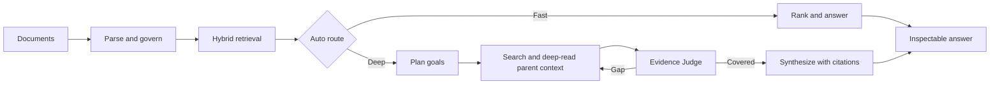
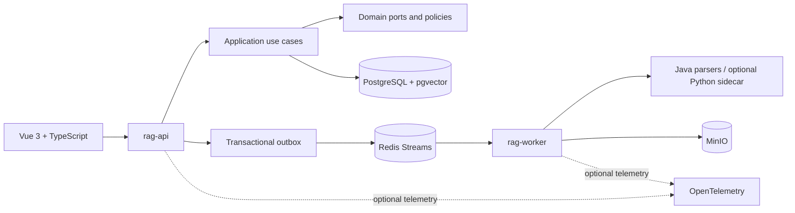

# VerityForge

> An evidence-first knowledge workspace for Fast, Auto, and Deep RAG.

**English** | [简体中文](README.zh-CN.md)

VerityForge is a desktop web application for turning an enterprise document corpus into a searchable, inspectable knowledge workspace. It combines document governance, hybrid retrieval, Agentic RAG, citations, and evaluation in one product surface so that an answer can be traced back to the evidence and the run that produced it.

This repository is a **portfolio release**. It is published so people can inspect the design and implementation, follow the engineering decisions, and run a local evaluation where the required infrastructure is available. It is not presented as a hosted SaaS product or as a drop-in production deployment.

<p align="center">
  <a href="http://idcmnt1.truesight.com.cn:18306"><strong>Open the current demo</strong></a>
  &nbsp;&middot;&nbsp;
  <a href="docs/showcase/README.md">View the showcase assets</a>
  &nbsp;&middot;&nbsp;
  <a href="benchmarks/agentic-v8-goal-batched-parent-200-20260807.md">Read the 200-case report</a>
</p>

> **Demo note:** the current preview is served from `http://idcmnt1.truesight.com.cn:18306`. It is a shared, HTTP-only demonstration endpoint and may be unavailable or change without notice. Do not enter private information or production credentials. The screenshots in this repository are the stable reference for the experience.


## What This Shows

The project is intentionally presented as one end-to-end system rather than a single model experiment:

- **Product workflow:** desktop Chat, KnowledgeOps, Research, Evaluation, Memory, and administration workspaces.
- **Retrieval judgment:** Fast and Auto modes for routine questions, with Deep mode for multi-goal research and evidence coverage.
- **Traceable answers:** citations resolve to effective document versions and source anchors; unsupported claims can be withheld or disclosed as evidence-limited.
- **Operational engineering:** modular Java services, asynchronous ingestion, resumable runs, access control, encrypted model credentials, and optional local observability.
- **Evaluation discipline:** real Fast/Deep runs, persisted diagnostics, paired comparisons, latency, token, citation, version, and leakage checks.

## The Core Flow



Deep runs follow a bounded, persisted evidence workflow: a complex question can be rewritten into typed goals, searched with keyword/semantic/hybrid strategies, fused and reranked, read through parent context, checked by an Evidence Judge, and revisited with a gap query when coverage is insufficient. The final answer receives accepted evidence rather than an opaque retrieval dump.

## Product Surface

The desktop web application is the primary public artifact.

| Workspace | What it demonstrates |
| --- | --- |
| Chat | Fast, Auto, and Deep question answering with citations, metadata filters, and resumable streaming |
| KnowledgeOps | Multi-format ingestion, document versions, metadata schemas, access policies, and index generations |
| Research | Persisted plans, retrieval tasks, evidence, coverage rounds, budgets, and run diagnostics |
| Evaluation | Dataset import/export, real Fast/Deep runs, comparisons, trends, schedules, and citation checks |
| Memory | User-scoped, confirmed long-term facts kept separate from answer evidence |
| Team / Security / AI configuration | Role enforcement, session revocation, credential rotation, and model profile management |


## Evidence From the Current Release

The numbers below are reported for specific benchmark runs and are not general performance guarantees. The two reports use different evaluation scopes and should be read separately.

### Agentic retrieval: 200 cases

The `GOAL_BATCHED_PARENT` v8 run completed all 200 cases after resumable continuation:

| Metric | Result |
| --- | ---: |
| Successful cases | **200 / 200** |
| Recall@5 | **0.9758** |
| Recall@10 | **0.9808** |
| AEC / RCC | **0.9191 / 0.9373** |
| P50 / P95 latency | **38.6 s / 60.5 s** |
| Scope, version, and tool leakage | **0** |

Against the historical GPT-5.5 ReAct run on the same benchmark, Recall@5 improved from `0.8550` to `0.9758`, P50 latency fell from `70.1 s` to `38.6 s`, and actual token use fell by about `57.7%` including retries. The complete methodology, run snapshots, category breakdown, and remaining failure modes are in the [200-case report](benchmarks/agentic-v8-goal-batched-parent-200-20260807.md).

### Complete answers: five difficult cases

The separate five-case acceptance run evaluates the full chain, including final answer generation and model judging:

| Metric | Deep v2 | Fast |
| --- | ---: | ---: |
| Recall@5 | **1.0000** | 0.3667 |
| Final-answer coverage | **0.5460** | 0.2121 |
| Semantic correctness | **0.9740** | 0.1500 |
| Citation support | **0.9460** | 0.3500 |
| Mean latency | 78.6 s | **21.3 s** |

The trade-off is intentional: Deep spends more time on multi-goal evidence work, while Fast remains the lower-latency path for routine questions. See the [five-case full-answer report](benchmarks/agentic-v8-final-answer-v2-five-case-20260807.md) for the exact cases, prompts, budgets, and stability notes.


## Architecture

The system is a modular monolith with a separately deployed ingestion worker. PostgreSQL is the business and index source of truth; Redis coordinates asynchronous work and MinIO stores document assets.



The main code boundaries are:

- `apps/rag-api`: REST, SSE, authentication, and management endpoints.
- `apps/rag-worker`: ingestion, parsing, indexing, retry, and recovery workers.
- `modules/rag-domain`: framework-independent retrieval, chunking, Agent, and policy models.
- `modules/rag-application`: use cases and Fast/Deep orchestration.
- `modules/rag-infrastructure`: PostgreSQL, pgvector, Redis, MinIO, model, and parser adapters.
- `modules/rag-contract`: versioned API, SSE, event, and sidecar contracts.
- `web`: the desktop Vue workbench.
- `parser-sidecar`: optional advanced PDF/OCR parsing.
- `model-sidecar`: optional GPU-backed BGE embedding and reranking.

Continue through the curated [design and evidence index](docs/README.md), or open [architecture.md](docs/architecture.md), [implementation-status.md](docs/implementation-status.md), and the [showcase guide](docs/showcase/README.md) directly.

## Local Evaluation

The repository is designed for local experimentation, not one-click public hosting. The default stack expects Java 25, Docker, PostgreSQL with pgvector, Redis, and MinIO. Optional Deep/local-model paths can use a GPU-backed model sidecar.

```bash
cp .env.example .env
./scripts/bootstrap-toolchain.sh
docker compose up -d postgres redis minio minio-init
./mvnw test
```

To build the application images:

```bash
./mvnw -DskipTests package
docker compose --profile app up --build
```

Model providers and credentials are configured through local environment variables and admin-created profiles. Never commit `.env`, API keys, model checkpoints, production URLs, or personal data. See [docs/development.md](docs/development.md) and [docs/deployment.md](docs/deployment.md) before attempting a full deployment.

## Public Release Boundaries

- The public artifact targets **desktop web**. Mobile screenshots and mobile-specific claims are intentionally out of scope for this portfolio release.
- The included enterprise corpus is synthetic. It is retained for research and experimentation under its own [MIT license](test_data/RAG-Multi-Corpus/LICENSE); it does not represent real organizations or confidential information.
- Benchmark values are point-in-time results tied to named datasets, model profiles, prompts, and runtime snapshots. They should not be read as universal quality or latency guarantees.
- The current Demo is a shared preview, not a private workspace. Do not upload sensitive documents or use real credentials there.
- This repository contains the source and design of a portfolio project. It is not a security review, a managed service, or a production deployment recipe.

## License and Attribution

Original VerityForge source and documentation are available under the [VerityForge Viewing and Learning License](LICENSE). That license permits reading, research, and personal non-commercial local evaluation; it does not grant permission to redistribute, publicly deploy, or commercially use the project without written authorization.

Third-party components remain under their own terms. See [THIRD_PARTY_NOTICES.md](THIRD_PARTY_NOTICES.md) for the WeKnora design attribution and [test_data/RAG-Multi-Corpus/README.md](test_data/RAG-Multi-Corpus/README.md) for dataset authorship and citation information.

This is a curated portfolio rather than an open-source community distribution. Issue, discussion, and pull-request expectations are described in [CONTRIBUTING.md](CONTRIBUTING.md); security concerns should follow [SECURITY.md](SECURITY.md).

## About This Release

This public snapshot is derived from the `release` branch at commit `b19dfc5` on 2026-08-08. Publication-only hardening removes environment-specific endpoints, keeps model credentials in AES-256-GCM envelopes, removes full-key reveal behavior, and adds a fail-safe migration for the temporary V42 plaintext credential column. The internal development history contains exploratory notes and private-environment details, so future public updates may be curated rather than a direct mirror of every internal commit.

For questions about the design, evaluation methodology, or permission to use the source beyond the terms above, open a discussion in the repository or contact the author through the GitHub profile [@yanyue2024](https://github.com/yanyue2024).
