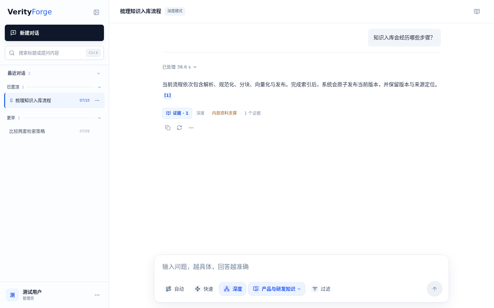
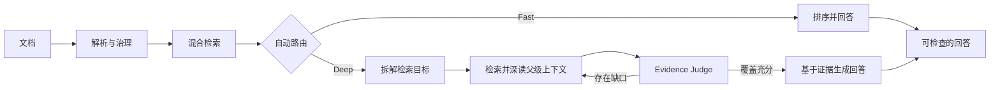
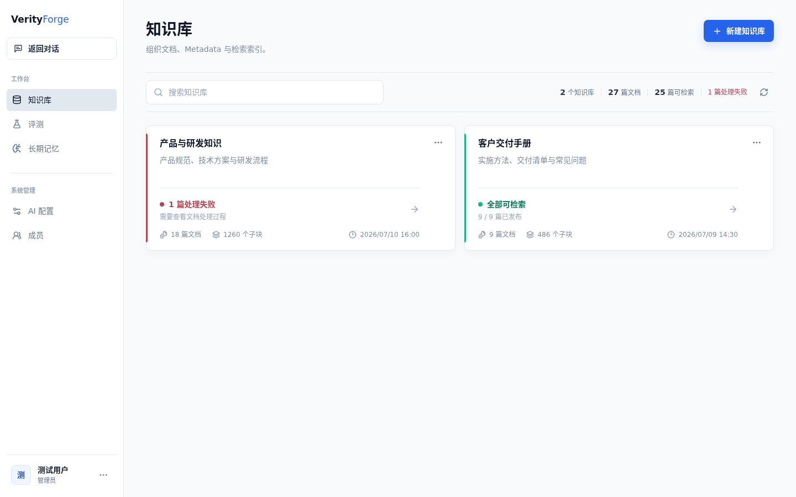
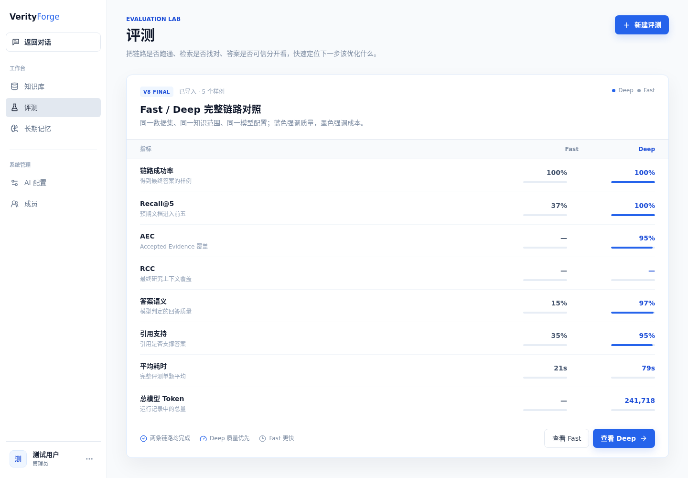

# VerityForge

> 面向 Fast、Auto 与 Deep RAG 的证据优先知识工作台。

[English](README.md) | **简体中文**

VerityForge 是一个桌面 Web 知识工作台，用于把文档语料转化为可检索、可追踪、可评测的知识系统。它把文档治理、混合检索、Agentic RAG、引用定位和质量评测放在同一个产品界面中，使回答可以回到产生它的运行记录、文档版本与原文证据。

本仓库是一个**作品集版本**：用于展示产品设计、系统实现、工程决策和阶段性评测结果，并允许在具备所需基础设施时进行个人、非商业的本地评估。它不是托管 SaaS，也不是可以未经审查直接上线的生产部署包。

<p align="center">
  <a href="http://idcmnt1.truesight.com.cn:18306"><strong>打开当前演示</strong></a>
  &nbsp;&middot;&nbsp;
  <a href="docs/showcase/README.md">查看展示素材</a>
  &nbsp;&middot;&nbsp;
  <a href="benchmarks/agentic-v8-goal-batched-parent-200-20260807.md">阅读 200 题报告</a>
</p>

> **演示说明：** 当前预览地址为 `http://idcmnt1.truesight.com.cn:18306`。这是一个共享、仅 HTTP 的演示端点，可能临时不可用或随版本变化。请勿输入隐私信息、生产凭据或上传敏感文档。仓库内的可复现截图是稳定的展示基准。



## 这个作品展示什么

- **完整产品流程：** 桌面对话、知识库治理、Research 运行、评测、长期记忆与管理界面，而不是单一模型实验。
- **检索策略判断：** 日常问题可使用 Fast 或 Auto；复杂、多目标问题可进入 Deep 检索与证据补全流程。
- **可追踪回答：** 引用可以解析到生效的文档版本和来源位置；证据不足时，回答可以收敛或明确披露限制。
- **工程可运行性：** 模块化 Java 服务、异步入库、可恢复运行、访问控制、模型凭据加密和可选的本地可观测性。
- **评测纪律：** 保存真实的 Fast/Deep 运行、逐题诊断、延迟、Token、引用、版本与越权泄漏检查。

## 核心链路



Deep 运行采用有边界、可持久化的证据流程：复杂问题可以拆为带类型的目标，分别执行关键词、语义或混合检索，经过融合与重排后读取父级上下文，再由 Evidence Judge 检查覆盖情况。若仍有缺口，系统可以生成一次补检查询。最终回答接收的是已经验收的证据，而不是不可解释的检索结果堆叠。

## 桌面产品界面

| 工作区 | 展示内容 |
| --- | --- |
| 对话 | Fast、Auto、Deep 问答，引用、Metadata 过滤与可恢复流式运行 |
| 知识库 | 多格式入库、文档版本、Metadata Schema、访问策略与索引代际 |
| Research | 持久化计划、检索任务、证据、覆盖轮次、预算与运行诊断 |
| 评测 | 数据集导入导出、真实 Fast/Deep 运行、对照、趋势、计划任务与引用检查 |
| 长期记忆 | 经过用户确认的长期事实，与回答证据严格分离 |
| 成员 / 安全 / AI 配置 | 角色权限、会话撤销、凭据轮换与模型配置管理 |



## 当前版本的结果证据

以下数字对应明确命名的 benchmark 运行，不代表一般性性能承诺。200 题报告只评估检索与证据链路；五题报告评估包含最终回答在内的完整链路，两者口径不同。

### Agentic 检索：200 题

`GOAL_BATCHED_PARENT` v8 运行通过增量续跑完成全部 200 题：

| 指标 | 结果 |
| --- | ---: |
| 成功题 | **200 / 200** |
| Recall@5 | **0.9758** |
| Recall@10 | **0.9808** |
| AEC / RCC | **0.9191 / 0.9373** |
| P50 / P95 延迟 | **38.6 s / 60.5 s** |
| 范围、版本与工具泄漏 | **0** |

相对同一 benchmark 的历史 GPT-5.5 ReAct 运行，Recall@5 从 `0.8550` 提高到 `0.9758`，P50 从 `70.1 s` 降至 `38.6 s`，包含失败重试在内的实际 Token 下降约 `57.7%`。完整运行快照、分类结果、方法与剩余问题见 [200 题报告](benchmarks/agentic-v8-goal-batched-parent-200-20260807.md)。

### 完整回答：五个困难案例

另一组五题验收覆盖最终回答生成与模型评判：

| 指标 | Deep v2 | Fast |
| --- | ---: | ---: |
| Recall@5 | **1.0000** | 0.3667 |
| 最终回答覆盖 | **0.5460** | 0.2121 |
| 语义正确性 | **0.9740** | 0.1500 |
| 引用支持 | **0.9460** | 0.3500 |
| 平均延迟 | 78.6 s | **21.3 s** |

这体现的是明确取舍：Deep 为困难、多目标问题投入更多证据工作；Fast 为常规问题保留更低延迟。逐题数据、Prompt、预算和稳定性记录见 [五题完整回答报告](benchmarks/agentic-v8-final-answer-v2-five-case-20260807.md)。



## 架构与本地评估

系统采用模块化单体，并将入库 Worker 独立部署。PostgreSQL 是业务与索引事实来源，Redis 协调异步任务，MinIO 保存文档资产。主要代码边界如下：

- `apps/rag-api`：REST、SSE、认证与管理接口。
- `apps/rag-worker`：入库、解析、索引、重试与恢复。
- `modules/rag-domain`：与框架无关的检索、分块、Agent 和策略模型。
- `modules/rag-application`：用例以及 Fast/Deep 编排。
- `modules/rag-infrastructure`：PostgreSQL、pgvector、Redis、MinIO、模型与解析器适配。
- `web`：桌面 Vue 工作台。
- `parser-sidecar` / `model-sidecar`：可选的高级解析与本地 BGE 模型服务。

本地评估默认需要 Java 25、Docker、PostgreSQL + pgvector、Redis 与 MinIO：

```bash
cp .env.example .env
./scripts/bootstrap-toolchain.sh
docker compose up -d postgres redis minio minio-init
./mvnw test
```

构建应用镜像：

```bash
./mvnw -DskipTests package
docker compose --profile app up --build
```

模型提供方与凭据通过本地环境变量和管理端模型配置提供。不要提交 `.env`、API Key、模型权重、生产地址或个人数据。完整材料可从 [设计与证据索引](docs/README.md) 继续阅读，也可直接查看 [架构](docs/architecture.md)、[开发](docs/development.md) 与 [部署](docs/deployment.md)。

## 公开边界与许可

- 本次作品集只以 **18306 桌面 Web** 为展示范围，不提供移动端截图或移动端能力承诺。
- 仓库内的企业语料为合成数据，按其自身的 [MIT License](test_data/RAG-Multi-Corpus/LICENSE) 保留，仅用于研究与实验。
- benchmark 数值绑定具体数据集、模型配置、Prompt 与运行快照，不应解释为普遍质量或延迟保证。
- 当前演示为共享预览，不是私有工作区。请勿上传敏感材料或使用真实凭据。
- 原创 VerityForge 代码与文档采用 [VerityForge Viewing and Learning License](LICENSE)：允许阅读、研究与个人非商业本地评估；未经书面授权，不允许再分发、公开部署或商业使用。
- 第三方组件继续适用各自许可，详见 [THIRD_PARTY_NOTICES.md](THIRD_PARTY_NOTICES.md)。

本仓库是整理维护的作品集，而不是面向社区协作的常规开源发行版。Issue、Discussion 与 Pull Request 的边界见 [CONTRIBUTING.md](CONTRIBUTING.md)，安全问题请按 [SECURITY.md](SECURITY.md) 私下报告。

本公开快照由 `release` 分支的 `b19dfc5`（2026-08-08）派生，并加入仅用于公开发布的安全加固：移除私有环境地址、继续以 AES-256-GCM 信封保存模型凭据、取消完整密钥回显，并为 V42 曾引入的临时明文凭据列增加拒绝静默迁移的保护。内部开发历史包含探索记录与私有环境细节，因此后续公开版本也会以整理后的快照发布，而不是逐提交镜像。

关于设计、评测方法或超出当前许可的使用授权，可以在仓库中发起 Discussion，或通过 GitHub 主页联系 [@yanyue2024](https://github.com/yanyue2024)。
