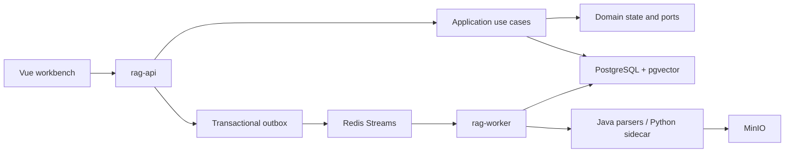
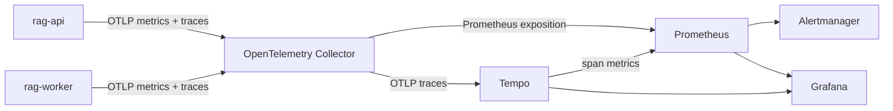

# Architecture

The repository is a modular monolith with a separately deployed ingestion worker. PostgreSQL is the business and
index source of truth; Redis only coordinates asynchronous work and transient state.



Operational telemetry follows a separate, non-authoritative path:



All observability management ports bind to host loopback and are excluded from the public FRPC route. Telemetry can
be discarded and rebuilt without changing document, conversation, Run, or ingestion state in PostgreSQL.

## Module boundaries

- `rag-contract` contains versioned REST, SSE, and parser contracts.
- `rag-domain` contains chunking, retrieval scope, Agent state, budgets, and outbound ports without Spring AI or SQL.
- `rag-application` coordinates document ingestion, Fast RAG, persistent Agent runs, and event streaming.
- `rag-infrastructure` implements jOOQ persistence, pgvector retrieval, object storage, Redis, and model adapters.
- `rag-api` owns authentication, authorization, REST endpoints, and resumable SSE.
- `rag-worker` consumes ingestion notifications and idempotently advances persisted stages.

## Authentication and team roles

The deployment has one organization with `ADMIN`, `EDITOR`, and `VIEWER` roles. Passwords use Argon2id and usernames
are unique case-insensitively inside the organization. JWTs contain a persisted `auth_version`; the authentication
filter verifies the signature and then reloads the enabled user and session version from PostgreSQL. Disabling a
member, changing a role, resetting a password, or changing one's own password increments that version, so previously
issued tokens stop authorizing requests immediately. Team administration is server-enforced with method security;
frontend route visibility is only an ergonomic reflection of the backend policy.

Members are disabled rather than deleted because knowledge, conversations, evaluation schedules, and audit records
retain creator references. Transactional update rules prevent the current administrator from disabling or demoting
themselves and prevent the organization from losing its final enabled administrator.

## Knowledge publication

`DocumentVersion` is immutable after publication. A new version is parsed and indexed while hidden, then
`current_version_id` is changed in one transaction. `RetrievalScope` always applies organization, publication,
validity, current-version, and enabled-chunk predicates. Old chunks remain addressable for historical citations
until retention cleanup.

## Ingestion and index generations

Ingestion stages are individually persisted and idempotent. Duplicate Redis deliveries stop at the completed job;
after a stage failure, an attempt resumes from the first non-successful stage. Publication locks the logical document
and changes the old version status, new version status, and `current_version_id` in one PostgreSQL transaction, so a
pointer-switch failure leaves the old published version fully retrievable.

The Redis Stream is durable coordination rather than job state. The Worker first drains its own Pending entries,
claims entries whose previous consumer has been idle beyond the configured threshold, and then reads new entries.
Missing consumer groups are recreated, malformed entries are moved to a dead-letter Stream, and the source Stream
is kept persistent without a key TTL. Outbox retry attempts and backoff are committed in PostgreSQL even when Redis
is unavailable.

Each running ingestion attempt persists `heartbeat_at`. A periodic heartbeat covers long parser, object-storage,
and model calls; every stage write also locks the Job and verifies the expected attempt number. Stale recovery
atomically either requeues the Job with an Outbox event or, after the retry limit, fails the Job and unpublished
version. A recovered old Worker therefore cannot write artifacts, vectors, stage state, or publication pointers.
This Worker lease timeout is an infrastructure recovery boundary and does not impose a Fast/Deep answer deadline.

An Index Rebuild writes only to a `BUILDING` Generation while retrieval continues using the existing `ACTIVE`
Generation. Each batch commits independently and the job retries up to three attempts without discarding completed
vectors. Progress and activation coverage are computed from the current published, enabled child-Chunk set rather
than only the job-creation snapshot, so documents published during a rebuild are included. Activation is deferred
while ingestion is pending or running and retires the old Generation in the same transaction that activates the new
one. A heartbeat recovery process requeues stale attempts; an attempt number fences late work from a superseded
Worker. The KnowledgeOps table exposes attempt count, next retry time, and the last error.

## Retrieval and Agent execution

Fast RAG runs keyword and semantic retrieval concurrently, fuses candidates with RRF, expands parent and adjacent
context, reranks, generates, persists citations, and streams replayable events.

There are two deliberately versioned Deep runtimes. Existing `agentic-react-v1` records remain resumable through the
ReAct persistence adapter. New Deep and AUTO-routed complex runs use `agentic-hybrid-v2`, so changing the orchestration
does not reinterpret an old checkpoint.

`agentic-hybrid-v2` is a controlled loop rather than an unconstrained tool conversation:

```text
AUTO/DEEP
  -> short-memory query rewrite (only when needed)
  -> Planner: independent subquestions + per-query KEYWORD/SEMANTIC/HYBRID strategy
  -> concurrent RetrievalTask batches (maximum parallelism 4)
       KEYWORD: keyword candidates
       SEMANTIC: dense candidates
       HYBRID: keyword + dense -> per-query RRF fusion
       each query -> per-query Rerank -> query-local Top K
  -> Deep Read: parent + adjacent context expansion, fair task allocation
  -> bounded evidence extraction batches (up to 3 subquestions/request): exact source spans -> EvidenceItem / evidence pool
  -> mandatory Evidence Judge
       sufficient -> evidence-grounded synthesis
       insufficient -> gap-specific queries -> next retrieval round
```

The fusion and rerank boundary is intentionally query-local. Results from unrelated subquestions are not put into a
single global ranking where one prolific question could starve another; the planner's task and the Evidence Judge
provide the cross-question coordination point.

Deep Read consumes the selected child hit only as a locator, expands it to its parent Chunk and adjacent parent
Chunks, and asks the evidence extractor to select a minimal continuous quote. Up to three independent subquestions
share one structured extraction request and batches execute serially, while retrieval tasks retain their concurrency
cap of 4. The server locates every quote in the expanded source and calculates
its offsets; PDF/Markdown line-wrap whitespace may be normalized for matching, but the persisted quote is always the
exact original source slice. Schema-invalid model output gets one repair attempt, while transport/time-out failures do
not trigger a second semantic repair request. Failed context is not promoted into the evidence pool; a
`DEEP_READ_FAILED` event leaves the missing evidence for the Judge and the next gap round. A physical Chunk consumes the deep-read
counter once, while the same immutable evidence may be linked independently to multiple subquestions with a
`cross-question-reuse` diagnostic source.

The v2 Evidence Judge is intentionally lightweight: it receives the plan and evidence pool directly, checks semantic
completion conditions, and Java deterministically enforces at least one deep-read evidence family per covered
subquestion plus conflict/gap constraints. It does not require the legacy Fact Ledger. Coverage and Judge results are
persisted before synthesis; a model cannot skip the Judge or declare an unsupported subquestion covered. Search
counters and the configurable `agenticLoopTimeoutSeconds` soft deadline prevent an unbounded retrieval loop. This
deadline is checked between stages rather than interrupting an in-flight model request. Final answer generation has
its own model timeout and is not silently truncated to fit the retrieval budget.

## Evaluation

Evaluation datasets keep insertion-stable questions, expected document IDs, optional expected answers, and custom
metadata. Standalone cases create independent hidden conversations; cases sharing `conversationGroup` execute by
contiguous `conversationTurn` in one conversation, so follow-up queries use the production short-memory and rewrite
path. A failed group turn skips its later turns rather than evaluating them against incomplete context. Runs execute
the same Fast or Deep pipeline as production chat. Results link to the
actual `rag_run`, use Fast retrieval candidates or persisted Deep evidence as appropriate, and aggregate Recall@10,
MRR, Hit@10, generated-answer coverage, no-answer accuracy, citation resolvability, effective-version leakage,
failures, and P95 latency. Metrics without grading labels are excluded from the relevant aggregate denominator.
Expected and forbidden document IDs are ownership-validated on import; forbidden Top-10 hits and leak-free rate are
observational diagnostics. Datasets can be moved through a versioned JSON bundle with organization ownership
validation. An explicit comparison
creates linked Fast and Deep Runs with identical scope, filters, model settings, and optional judge mode. Model judging
is opt-in and evaluates semantic answer correctness and citation entailment from the persisted answer and evidence;
judge failures are recorded per case and do not erase an otherwise successful RAG result.
The evaluator has no independent three-minute deadline: it polls the persisted RAG Run until a real terminal state,
and remains interruptible during application shutdown. This prevents a slow but healthy final generation from being
cancelled by the evaluation wrapper.

Regression schedules are PostgreSQL records rather than process-local cron definitions. Each record stores the
dataset, creator, cadence, knowledge scope, typed filters, model override, and judge mode. The API scheduler claims
due rows with one `FOR UPDATE SKIP LOCKED` update that advances `next_run_at`; another API instance therefore cannot
claim the same occurrence. A schedule is ineligible while its last linked Fast/Deep comparison still has a queued or
running Run. Manual `run-now` uses the same application use case without enabling the schedule. Trend queries join
the latest comparison pairs to their persisted aggregate Run metrics instead of copying metric snapshots.

An enabled schedule snapshots its webhook endpoint and encrypted signing secret into a unique notification delivery
when a comparison is launched. A separate dispatcher claims the delivery only after both linked Evaluation Runs are
terminal. `WAITING`, `DELIVERING`, `RETRY`, `SUCCEEDED`, and `FAILED` are persisted independently from comparison
state; attempt fencing prevents a late dispatcher from overwriting a newer retry. Delivery uses HMAC-SHA256 over
`timestamp + "." + rawBody`, applies bounded exponential backoff, and stores only truncated response diagnostics.
Private, loopback, link-local, multicast, and IPv6 unique-local destinations are rejected by default.
