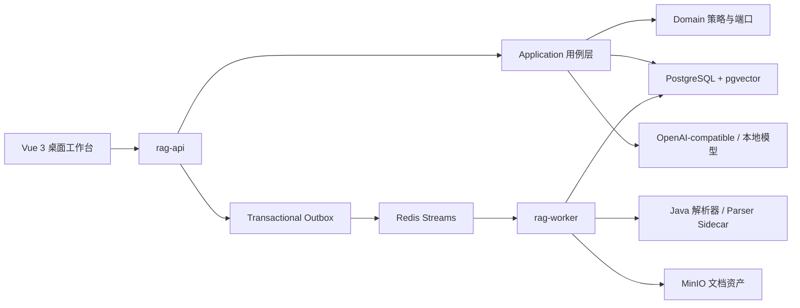
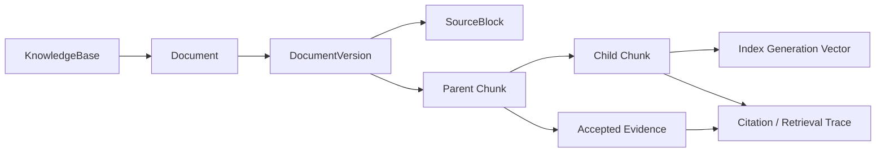
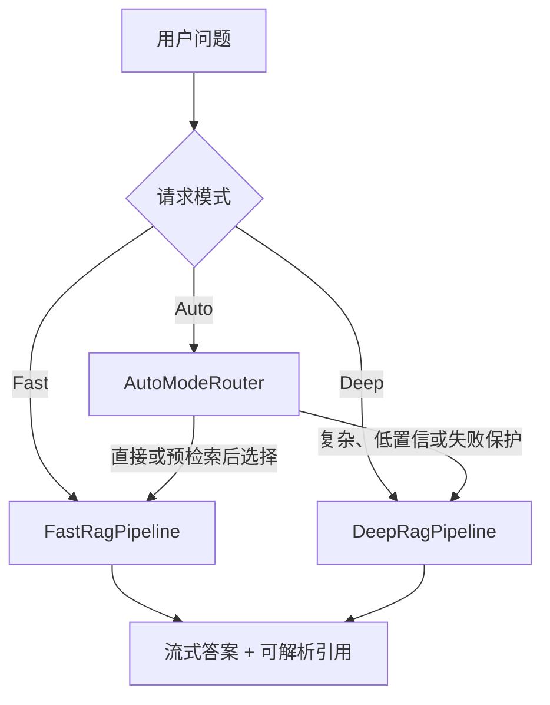

# 系统架构

VerityForge 是模块化单体加独立入库 Worker 的桌面 Web 系统。PostgreSQL 同时保存业务状态、文档版本、检索索引和运行 Artifact，是唯一业务事实来源；Redis 负责异步协调与缓存，MinIO 保存原始文件和派生资产。



## 模块边界

| 模块 | 责任 |
| --- | --- |
| `modules/rag-contract` | REST、SSE、事件和 Sidecar 的版本化数据契约 |
| `modules/rag-domain` | 分块、检索范围、Deep 状态、预算、证据与出站端口；不依赖 SQL |
| `modules/rag-application` | 知识库、Fast、Deep、Auto、评测和管理用例编排 |
| `modules/rag-infrastructure` | jOOQ、PostgreSQL、pgvector、Redis、MinIO、模型和解析器适配 |
| `apps/rag-api` | 认证授权、REST、可续接 SSE、调度和管理入口 |
| `apps/rag-worker` | 消费入库任务并幂等推进解析、分块、Embedding 和发布阶段 |
| `web` | Vue 3 + TypeScript 的桌面工作台 |
| `parser-sidecar` | 可选的高级 PDF、OCR 和版面解析 |
| `model-sidecar` | 可选的本地 BGE-M3 Embedding 与 Rerank 服务 |

依赖方向从 API / Worker 指向 Application、Domain 和 Contract。Domain 只声明规则与端口，基础设施实现具体存储和模型访问，因此 Fast、Deep 与评测可以在不把数据库细节带入领域模型的前提下复用同一检索契约。

## 数据与发布边界

核心关系如下：



`DocumentVersion` 发布后不可变。新版本在不可检索状态下完成解析和索引，然后在一个事务中切换 `current_version_id`；旧版本仍保留，以便历史回答的引用可以继续解析。所有检索都通过 `RetrievalScope` 强制约束组织、用户权限、知识库、文档过滤器、有效期、当前版本和启用状态。

父子分块的当前默认策略为：父块目标 1,000 Token、上限 1,200、重叠 100；子块目标 250、上限 384、重叠 40。子块负责精确召回，父块负责答案上下文和人工核验。策略名为 `parent-child-250-1000-final`，它是当前公开版本的稳定标识。

## 入库与恢复

上传首先创建 Upload Intent，文件进入对象存储后才提交处理任务。API 在同一数据库事务中写入业务状态和 Outbox；Dispatcher 将事件送入 Redis Stream，Worker 消费后推进各阶段。业务状态不依赖 Redis 消息是否仍存在。

每个阶段独立持久化且幂等：

```text
上传确认 -> 解析 -> 规范化 / 质量检查 -> 父子分块 -> Embedding -> 发布
```

Worker 为运行中的 Attempt 写入心跳和 Attempt 编号。超时恢复会原子地重新排队或在超过上限后失败；旧 Worker 的迟到写入会被编号栅栏拒绝。重复消息会在已完成阶段停止，不会重复发布文档。

索引重建写入独立的 `BUILDING` Generation，在线检索继续读取 `ACTIVE` Generation。新代际覆盖当前所有已发布子块并通过激活检查后，才在事务中替换旧代际。文档发布和索引重建因此不会让线上查询落入半成品索引。

## 三种回答模式

Fast、Deep 和 Auto 共用认证、检索范围、模型 Profile、引用持久化与 SSE 事件，但由 `RunCoordinator` 选择不同的当前实现。



Fast 读取最近 8 轮对话，在存在短指代或上下文依赖时执行 Query Rewrite；随后并发关键词和语义检索、RRF 融合、Rerank、父级上下文扩展、Token 装包和一次流式回答。用户确认的长期记忆最多读取 20 条，只进入个性化上下文，并明确标为不可作为企业文档证据。

Deep 是有界状态机：问题分析最多生成 3 个 Goal，每个 Goal 最多 3 个 Requirement 和一组 Keyword / Semantic Query；Goal 间并发研究，子块映射父块后按 Goal 批量深读。Evidence Judge 判断各 Requirement 是否覆盖，缺失 Goal 最多进行一轮 Read More 或 Repair Research，随后按唯一父块和覆盖优先级装包，最多生成一次最终回答。完整运行、预算和阶段快照都写入 PostgreSQL，可用于评测与审计。

Auto 不调用额外路由模型。明确的复杂信号先倾向 Deep；多 Goal / 分阶段问题可复用一次 Fast 预检索，用 Top-5 标题命中判断是否允许走 Fast。预检索异常、空问题或不确定输入固定选择 Deep。默认 `RETRIEVAL_AWARE_50` 是成本优先档，而非“永远自动选最优”的承诺。

## 引用与事件

Fast 保存关键词、语义、RRF、Rerank 和最终上下文的检索 Trace；Deep 额外保存 Goal、Requirement、候选、Deep Read、Accepted Evidence、Judge 决策和阶段 Checkpoint。答案中的编号引用绑定具体文档版本和 Chunk，服务端在持久化前校验引用是否来自本次允许的证据集合。

SSE 事件写入可回放的运行事件流。浏览器断线后可以从已确认的事件序号继续订阅；页面展示的是同一条服务端运行状态，而不是前端推测出的进度。

## 评测复用生产链路

评测问题保存期望文档、可选期望答案、禁止文档和场景 Metadata。每个案例调用与聊天相同的 Fast 或 Deep Pipeline；结果关联真实 `rag_run` 和持久化证据，不另造一套“离线简化版”检索器。

连续对话案例用 `conversationGroup` 与 `conversationTurn` 在同一个隐藏会话内顺序执行。Fast / Deep 对照固定相同的知识范围、过滤器和模型配置。模型 Judge 是显式开启的可选阶段，失败时记录为 Judge 失败，不会抹去已经成功的 RAG 运行。

## 安全与权限

- 角色为 `ADMIN`、`EDITOR`、`VIEWER`，授权由后端方法级检查执行。
- 密码使用 Argon2id；JWT 绑定数据库中的 `auth_version`，禁用成员、改角色或改密码会使旧 Token 失效。
- 模型和评测 Webhook 凭据使用带 Key ID 的 AES-256-GCM 信封加密，API 只返回 `hasApiKey`。
- 组织、当前版本、有效期与文档权限均在服务端检索范围中执行，前端过滤不构成安全边界。
- Webhook 默认拒绝私网、环回、链路本地、多播和 IPv6 ULA 地址，以降低 SSRF 风险。

## 可观测性与非权威状态

可选的 OpenTelemetry、Prometheus、Tempo、Alertmanager 与 Grafana 只接收低基数指标和 Trace。查询、文档正文、用户 ID、API Key 和 Run ID 不作为指标标签。遥测可以丢弃重建，不影响 PostgreSQL 中的文档、会话、评测或运行状态。

## 历史 Artifact 兼容

公开源码只有一套当前 Fast 和一套当前 Deep 编排。数据库迁移、旧运行恢复适配器和评测查询中仍识别少量历史 `pipeline_version`，目的仅是读取已持久化的旧运行结果并保持引用可解析；`RunCoordinator` 不会把新请求发送到这些旧实现。这个兼容层是数据迁移边界，不是多套产品版本并存。
