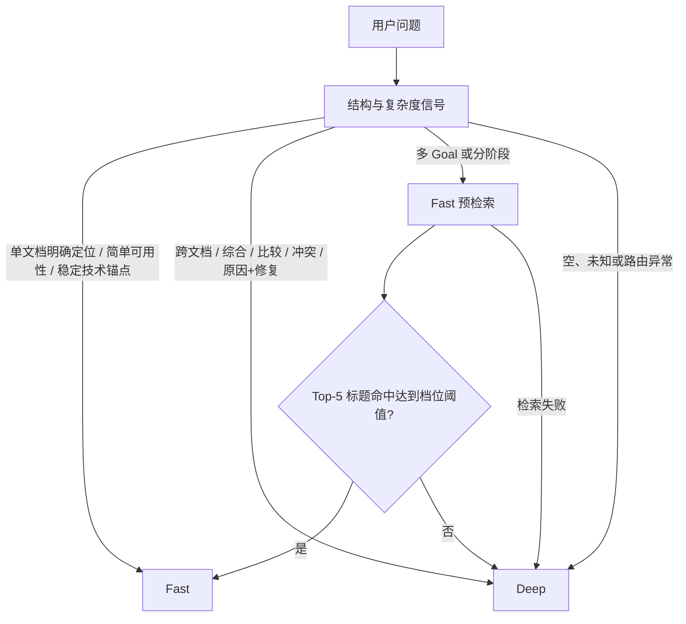

# Auto 模式

Auto 将“该走 Fast 还是 Deep”实现为可解释、零额外路由模型成本的产品策略。默认档追求约 50% 的研究成本下降，而不是宣称在所有问题上自动达到 Deep 的质量。

## 决策流程

预检索并发执行 `Keyword Top30 + Semantic Top30`，经 RRF 得到 Top40。若最终选择 Fast，且 Query Rewrite 没有改变问题，这批候选会直接复用，避免为了路由重复检索。

## 可解释信号

强制倾向 Deep 的信号包括：

- 两篇以上明确文档；
- 多目标、分阶段、跨文档综合；
- 比较、冲突或交叉验证；
- 原因诊断与修复措施同时出现。

单文档明确定位、简单“是否包含”问题或稳定英文技术锚点可以直接进入 Fast。其余不确定输入默认 Deep。路由结果保存 `reasonCode`、信号列表、档位、标题命中数、预检索耗时和 Top-5 摘要，页面与评测都可以解释一次选择。

## 两个档位

| 档位 | 多 Goal 标题命中阈值 | 定位 | 200 题研究 Token 变化 | Recall@5 |
| --- | ---: | --- | ---: | ---: |
| `RETRIEVAL_AWARE_50` | 1；分阶段仍要求 2 | 默认，成本优先 | `-50.16%` | `0.8667` |
| `RETRIEVAL_AWARE_28` | 2 | 质量优先 | `-27.58%` | `0.9367` |

默认档在 200 题回放中选择 Fast 107 题、Deep 93 题；质量档会把更多边界问题保留给 Deep。档位通过服务端配置选择，不需要更改聊天 UI 或训练分类模型。

## 结果口径

默认档与全 Deep 的同集对照：

| 指标 | 全 Deep | Auto 默认档 | 变化 |
| --- | ---: | ---: | ---: |
| Recall@5 | 0.9633 | 0.8667 | -0.0967 |
| Recall@10 | - | 0.8775 | - |
| MRR@5 | 0.9475 | 0.9277 | -0.0198 |
| RCC | 0.8212 | 0.8022 | -0.0190 |
| 研究 Token | 3,269,084 | 约 1,629,311 | -50.16% |
| 平均研究时间 | 46.85s | 23.41s | -50.04% |

这组回放双方都跳过最终回答，只测路由后的研究路径。因此 `-50.16% Token` 和 `-50.04% 时间` 不能写成端到端回答成本或用户等待时间下降。完整回答还取决于生成模型、输出长度、网络和模型服务波动。

## 失败保护

- 路由代码异常：Deep。
- 预检索异常或超时：Deep。
- 空问题或没有稳定信号：Deep。
- 明确跨文档、冲突、比较等复杂信号：不允许预检索把它降为 Fast。
- 用户显式选择 Fast / Deep：尊重用户覆盖，不再执行 Auto。

详细实验、样本构成和限制见 [Auto 质量成本报告](../benchmarks/auto-routing-cost-quality.md)。
