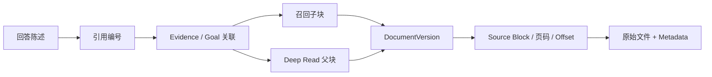
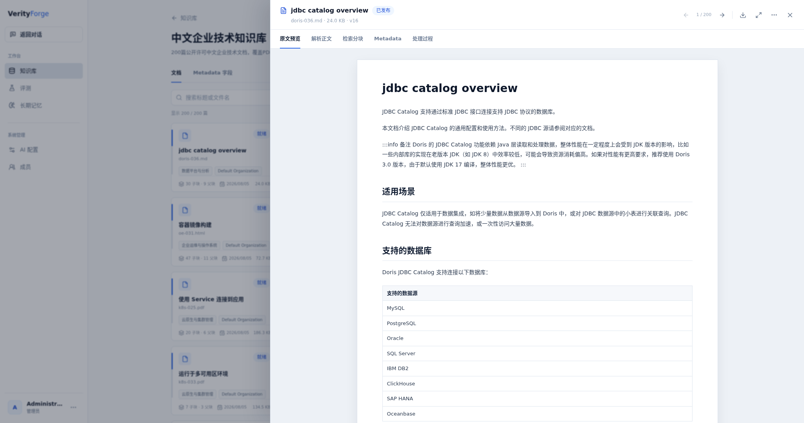

# 引用与证据溯源

引用是 VerityForge 的业务对象，不是模型输出中的装饰性脚注。每个有效引用都必须来自本次运行允许的证据集合，并解析到一个不可变文档版本。

## Fast 引用

Fast 的 Evidence ID 在上下文装包时分配。最终回答只能使用这些 ID；服务端校验后保存引用到命中的子块、文档版本和原文范围。证据面板同时读取父块，让用户看到短命中周围的完整语义，而不会改变回答实际引用的来源。

## Deep 引用

Deep 保存更完整的研究关系：

- Goal 和 Requirement；
- Keyword / Semantic Query；
- RRF / Rerank 后的召回子块；
- 子块定位到的父块；
- Deep Read 接纳的 Evidence；
- Evidence Judge 的覆盖结论；
- 最终回答引用。

最终回答优先引用已接纳父块。相同父块支持多个 Goal 时正文只装包一次，但证据面板仍展示所有 Goal 关联和触发召回的子块。引用的位置范围由父块的 Source Anchor 计算，不依赖模型自行编造页码。

## 文档版本稳定性

引用绑定 `document_version_id`，而不是只保存文档标题。上传新版本后：

1. 新问题默认只检索当前有效版本；
2. 旧回答仍解析到当时使用的旧版本；
3. 页面可以显示文档更新时间和历史版本；
4. 评测检查错误版本和越权范围泄漏。

这避免了“文档已经更新，旧答案却悄悄指向新正文”的错配。

## Source Block 和位置

解析器为正文保留 Source Block。不同格式可以提供页码、字符起止位置、章节路径或原始块标识。文档工作区允许在原文预览、解析正文、检索分块和 Metadata 之间切换，以同一版本核验引用。

## 证据不足的行为

- 没有有效候选：返回无企业证据状态。
- Rerank 全部低于阈值：记录低相关性原因，不将随机候选发给模型。
- Deep 只有部分 Goal 覆盖：生成 `PARTIAL_GROUNDED` 回答，并保留未覆盖状态。
- 引用编号无法解析或不在本次 Evidence 集合：不保存为有效引用。
- 长期个人记忆：可以辅助个性化表达，但 `evidenceEligible=false`，不能成为企业文档引用。

引用可以降低幻觉风险并提高可审计性，但不能从理论上消除模型错误。使用者仍应检查证据是否真正支持回答陈述，尤其是高风险业务决策。
