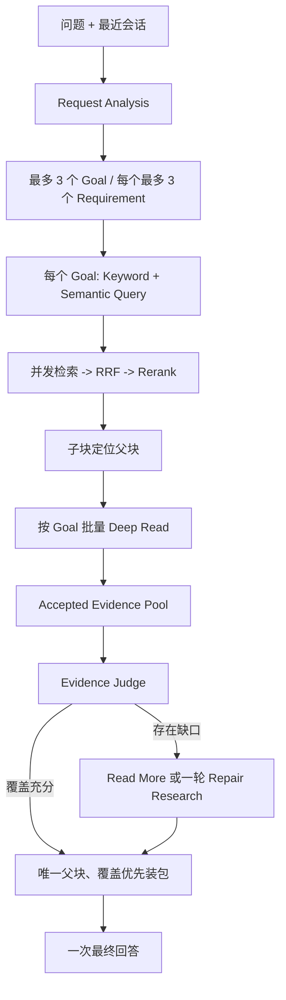
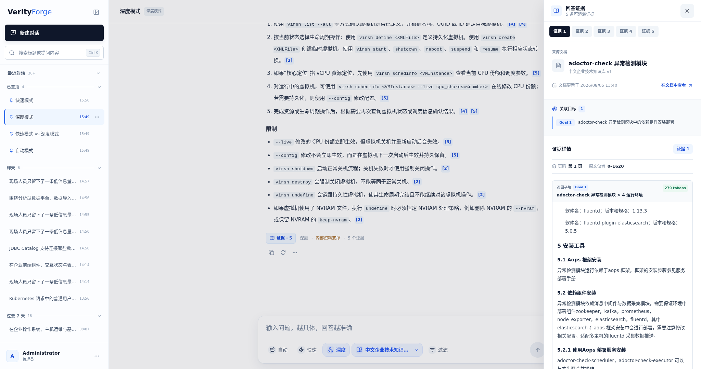

# Deep 模式

Deep 面向多目标、跨文档、比较、分阶段、冲突核验和证据不足的问题。它不是开放式无限 Agent，而是一条受 Token、调用次数、阶段和截止时间共同约束的持久化研究状态机。

## 1. 问题分析

Request Analyzer 先把会话依赖补成独立目标，然后输出最多 3 个 Goal。每个 Goal 包含：

- 独立问题与不可合并的范围；
- 最多 3 个可验证 Requirement；
- Keyword Query 与 Semantic Query；
- 答案约束和目标间关系。

Goal 是后续公平检索和证据判断的最小单元。多意图问题不会先拼成一个大 Query，再让排名靠前的单一目标挤占全部候选。

## 2. Goal 级研究

每个 Goal 的 Keyword / Semantic Search 并发执行，先在 Goal 内做 RRF 和 Rerank，再选取子块。最终质量档允许每路 Top60、RRF Top80、Rerank 输出 Top14；搜索并发上限 6，Rerank 和 Deep Read 并发上限各 3。

子块只充当定位锚点。系统根据持久化父子关系读取父块，在 Token 预算内按 Goal 批量交给 Deep Read。相同父块支持多个 Requirement 时保留多条关联，但不重复传输正文。

## 3. Evidence Pool 与充分性判断

Deep Read 只能从提供的父块中接纳证据，并保存父块 ID、关联 Goal / Requirement、原文位置和接纳阶段。`GoalEvidencePool` 对每个 Goal、Requirement、父块和阶段设置配额，避免某个来源无限扩张。

Evidence Judge 接收计划与证据池，对每个 Goal 返回：

- `SATISFIED_LOCKED`：需求已经有可验证证据，后续不再为它搜索；
- `NEEDS_REPAIR`：存在明确缺口，并给出修复 Query；
- 退化状态：模型或链路失败，不能把未知强行判成已覆盖。

Judge 之后，系统先尝试在已有候选中 `READ_MORE`；仍缺失且预算允许时，只对缺口 Goal 进行一轮 Repair Research。可选补检必须为最终回答预留预算，不能为了多搜一次耗尽回答所需 Token。

## 4. 最终证据装包

Accepted Evidence 先按父块去重，再依据 Goal / Requirement 覆盖、证据质量和 Token 预算装包。一个父块覆盖多个 Goal 时只序列化一次，同时保留所有 Goal 关联。当前最终质量档为回答输入预留最多 20,000 Token、输出最多 4,000 Token，且最终回答调用上限为 1。

证据为空时返回明确的无企业证据状态；部分 Goal 未覆盖时答案标记为 `PARTIAL_GROUNDED`，不会把不完整研究伪装成充分回答。

## 5. 状态、预算与恢复

运行按 `ANALYZING`、`PRIMARY_RESEARCH`、`JUDGING`、`REPAIR_RESEARCH`、`FINALIZING`、`COMPLETED` 等阶段写入 Checkpoint。预算账本同时限制物理搜索、Embedding、Rerank、父块读取、LLM 逻辑调用、物理尝试、输入输出 Token 和串行语义阶段。

取消请求、超时、预算不足和系统失败使用不同 Stop Reason。评测可以对失败案例增量续跑，而不重新计算已经成功的 192 个案例；200 题主验收正是通过两次续跑恢复 8 个失败案例，最终达到 200/200。

## 6. 已验证结果与边界

在中文企业技术知识库 v1 的 200 题困难集上，当前 Deep 检索与证据链路达到 Recall@5 0.9758、AEC 0.9191、RCC 0.9373，P50 38.6 秒。这个运行跳过最终回答，因此这些时间和 Token 只代表研究阶段。

5 题完整回答集启用最终生成与模型 Judge：Recall@5 1.0000、语义正确性 0.9740、引用支持 0.9460、平均耗时 78.6 秒。样本量较小，作用是验证回答装包和引用链，不是替代 200 题检索回归。

详细数据见 [200 题报告](../benchmarks/deep-rag-final-200-case.md) 与 [完整回答报告](../benchmarks/fast-vs-deep-full-answer.md)。
