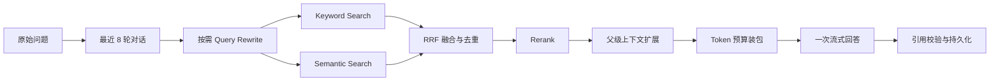
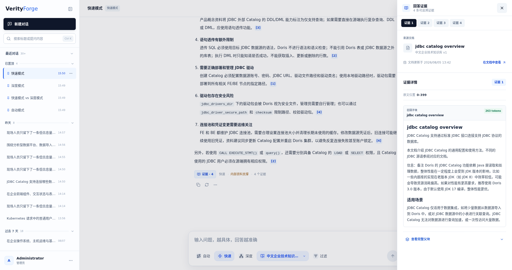

# Fast 模式

Fast 面向单目标事实查询、明确文档定位和常规操作问题。目标是在证据足够时用最短的生产链路生成可溯源答案，而不是省略检索步骤。

## 1. 会话补全

Fast 从 PostgreSQL 读取最近 8 轮有效对话。重新处理某一轮时，只读取该轮当前生效的 Assistant 回答，不会把已被替换的回答从缓存带回上下文。

只有在存在历史消息，且当前问题较短或含“它、这个、上面、刚才”等指代表达时才调用 Query Rewrite。改写结果必须是可独立检索的问题；模型调用失败时保留原问题并记录回退原因。

当前实现没有把自动历史摘要伪装成已完成能力。长期记忆来自用户主动确认的持久化事实，最多读取 20 条，单独放入个性化上下文，并带 `evidenceEligible=false` 标记，不能生成企业文档引用。

## 2. 混合检索与排序

关键词检索和语义检索在同一权限范围内并发执行。两路结果使用 Reciprocal Rank Fusion 合并，因此不需要把 BM25 与向量分数强行缩放到同一数值区间。融合候选去重后交给独立 Rerank Profile；若 Rerank 服务失败，链路保留可观察的回退结果，而不是静默返回空答案。

Rerank 后的结果还要经过最小相关性阈值。没有候选、全部低于阈值或上下文装包为空时，系统进入明确的无证据 / 降级回答路径，并记录具体原因。

## 3. 上下文和回答

子块命中后按配置扩展父块或邻接上下文，再由 `ContextPackBuilder` 在 Token 预算内选取证据。最终请求同时包含：

- Assistant 行为约束；
- 原始问题与独立改写问题；
- 最近对话；
- 已装包企业文档证据；
- 可选的个人长期记忆，明确不具备引用资格。

最终自然语言回答只调用一次流式模型。浏览器接收增量 Token，同时服务端保存完整答案、运行状态和引用。

## 4. 引用契约

生成模型只能引用本次上下文中分配的 Evidence ID。服务端会校验回答中的编号，将其解析到具体子块和文档版本，并保留父块上下文供查看。无法解析或不在允许集合内的引用不会作为有效引用持久化。

## 5. 适用边界

适合 Fast：

- “JDBC Catalog 支持哪些数据库？”
- “根据《某文档》，这一节给出的限制是什么？”
- 带稳定技术名词、范围清晰的单步骤问题。

应选择 Deep：

- 两个以上独立目标；
- 跨文档比较、冲突核对或综合；
- 原因分析与修复方案同时出现；
- 需要对每个条件分别证明覆盖。

Fast 在 5 题困难多目标完整回答集上的平均耗时为 21.3 秒，明显快于 Deep 的 78.6 秒；同一组题的 Recall@5 仅为 0.3667，说明速度优势不能外推为复杂问题质量相同。完整对照见 [评测报告](../benchmarks/fast-vs-deep-full-answer.md)。
